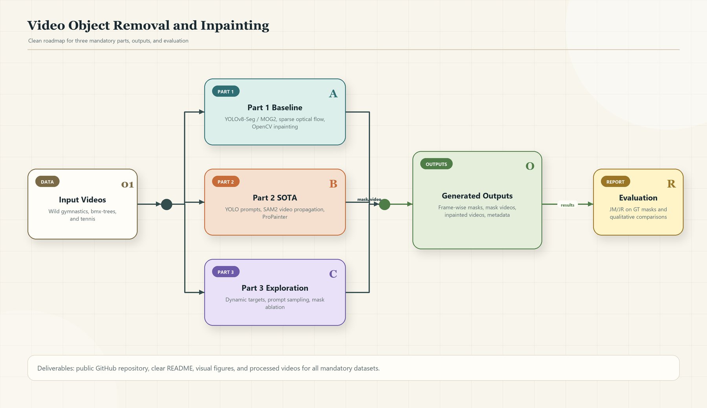
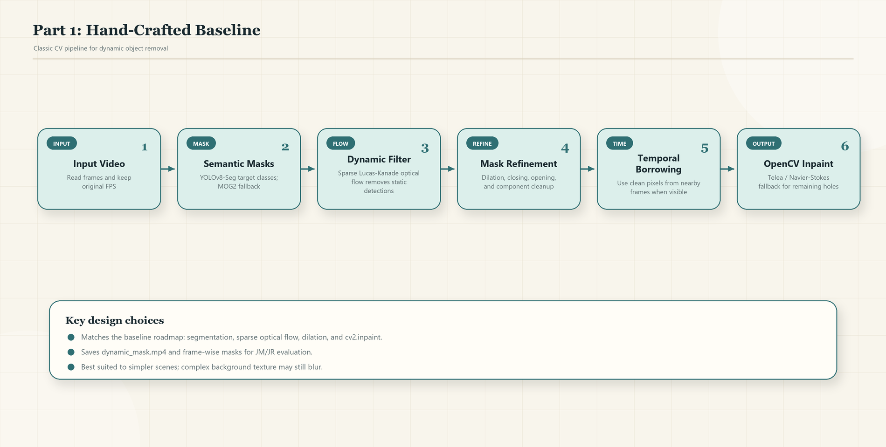
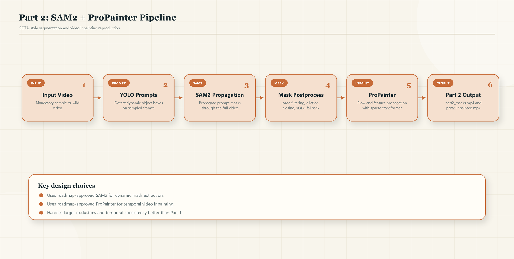
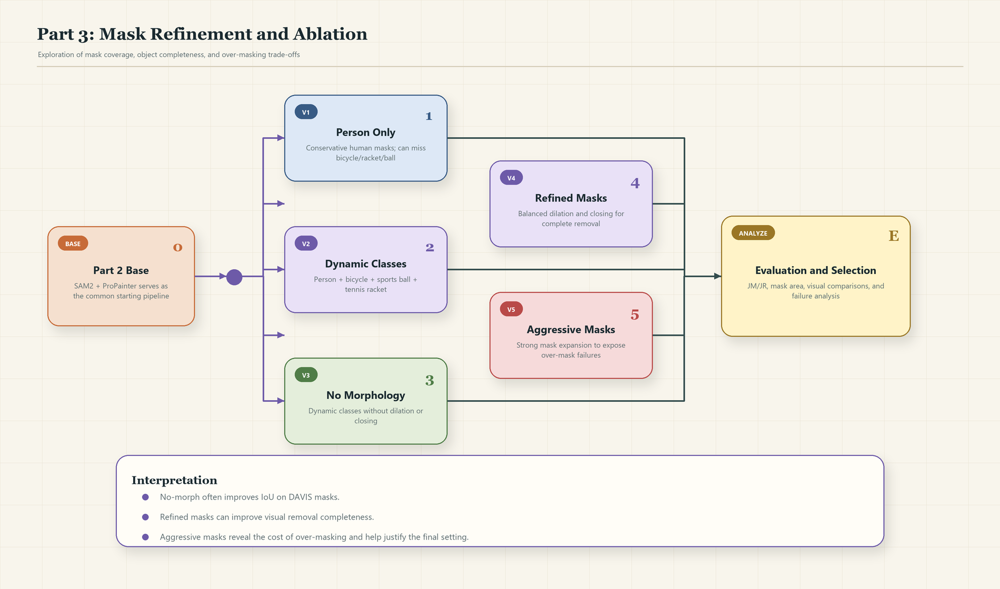
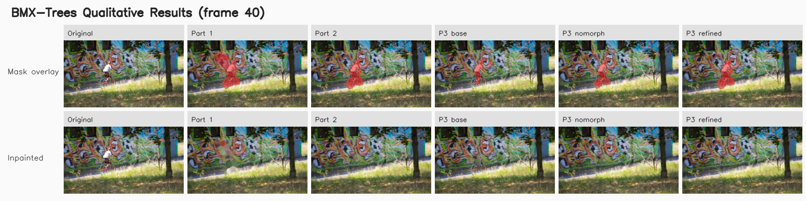
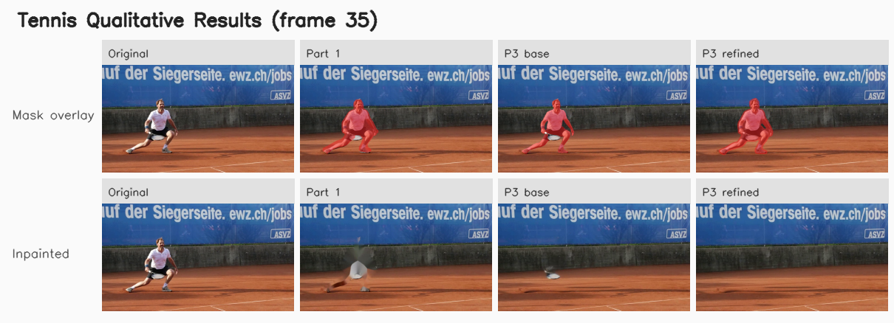
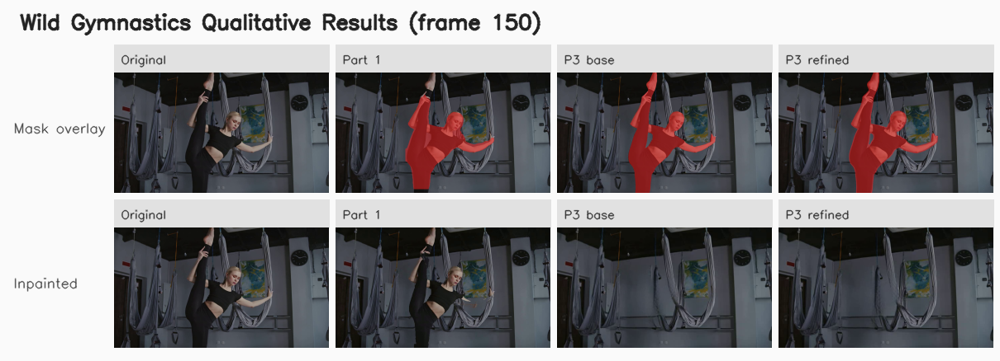
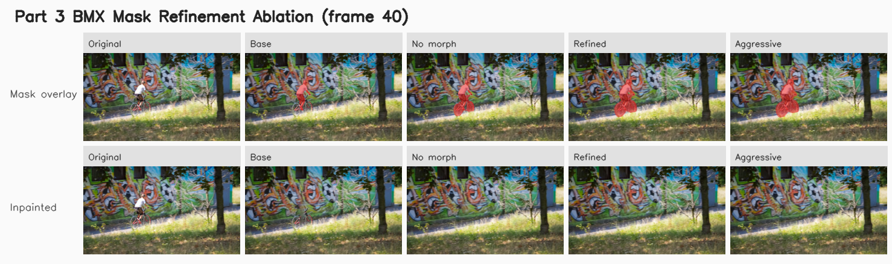

# Video Object Removal and Inpainting

Course project for video object removal. The repository contains three parts:

- Part 1: a traditional computer vision baseline.
- Part 2: a reproduced SOTA-style pipeline using SAM2 masks and ProPainter inpainting.
- Part 3: an exploration that improves the Part 2 mask generation strategy.

Recommended final commands are provided in the "How to Run" section. Part 2 outputs are prefixed with `part2_`; Part 3 outputs are prefixed with `part3_`.

The repository is intentionally kept GitHub-friendly. Large generated outputs, model weights, caches, and third-party repositories are not committed.

## Repository Structure

```text
.
|-- part1_pipeline.py               # Part 1: traditional baseline
|-- part2_pipeline.py               # Part 2: SAM2 + ProPainter runner
|-- part3_pipeline.py               # Part 3: refined/ablation entry point
|-- evaluate_metrics.py             # JM/JR mask metrics and PSNR/SSIM video metrics
|-- requirements.txt                # Python dependencies for project scripts
|-- configs/
|   |-- part2_example.yaml          # Main SAM2 + ProPainter setting
|   |-- part3_baseline_persononly.yaml
|   |-- part3_dynamic_nomorph.yaml
|   |-- part3_refined_dynamic_objects.yaml
|   `-- part3_dynamic_aggressive.yaml
|-- tools/
|   |-- sam2_auto_mask.py           # YOLO prompt selection + SAM2 video propagation
|   `-- propainter_adapter.py       # Adapter that calls ProPainter
|-- data/
|   |-- sample/
|   |   |-- bmx-trees.mp4
|   |   `-- tennis.mp4
|   `-- wild/
|       `-- gymnastics_easy_long_12s_720p.mp4
`-- outputs/                        # Generated locally; ignored by git
```

## Method Flowcharts

These flowcharts summarize the technical roadmap used in the report.

### Overall Roadmap



### Part 1: Hand-Crafted Baseline



### Part 2: SAM2 + ProPainter



### Part 3: Mask Refinement and Ablation


## Method Summary

### Part 1: Traditional Baseline

`part1_pipeline.py` implements a classical baseline:

- Detect candidate foreground objects with YOLOv8 segmentation when available.
- Estimate frame-to-frame motion with sparse optical flow.
- Keep dynamic object regions using motion consistency.
- Refine masks with dilation and temporal smoothing.
- Remove the object using OpenCV inpainting.

This part is designed as a transparent baseline rather than a SOTA method.

### Part 2: SOTA Reproduction

`part2_pipeline.py` runs a modular SOTA-style pipeline:

- Mask backend: SAM2, driven by YOLO prompt boxes from selected frames.
- Inpainting backend: ProPainter.
- The command templates are stored in `configs/part2_example.yaml`.

The final Part 2 setting targets dynamic objects such as people, bicycles, sports balls, and tennis rackets, because the project asks for removing the moving object/activity rather than only the human body.

### Part 3: Exploration / Optimization

`part3_pipeline.py` is a thin entry point for the Part 3 exploration. It uses the same execution engine as Part 2 but should be run with the Part 3 configs:

- `part3_baseline_persononly.yaml`: conservative person-only baseline.
- `part3_dynamic_nomorph.yaml`: dynamic object classes without mask morphology.
- `part3_refined_dynamic_objects.yaml`: recommended setting; dynamic classes plus balanced dilation/closing.
- `part3_dynamic_aggressive.yaml`: stronger mask expansion for ablation.

The recommended final Part 3 setting is `part3_refined_dynamic_objects.yaml`, because it improves object coverage while avoiding excessive over-masking.

## Installation

Create and activate a Python environment first. On Windows PowerShell:

```powershell
python -m venv .venv
.\.venv\Scripts\Activate.ps1
python -m pip install --upgrade pip
python -m pip install -r requirements.txt
```

For CUDA, install the PyTorch build that matches your GPU/CUDA version before running the full SAM2 + ProPainter pipeline.

## External Dependencies for Part 2 / Part 3

Part 1 can run with the base dependencies. Part 2 and Part 3 require SAM2 and ProPainter.

### Install SAM2

One common local setup is:

```powershell
mkdir third_party
cd third_party
git clone https://github.com/facebookresearch/sam2.git
cd sam2
$env:SAM2_BUILD_CUDA='0'
python -m pip install -e .
cd ..\..
```

If CUDA extension compilation is available on your machine, you may omit `SAM2_BUILD_CUDA=0`.

### Install ProPainter

```powershell
cd third_party
git clone https://github.com/sczhou/ProPainter.git
cd ProPainter
python -m pip install -r requirements.txt
cd ..\..
```

Download ProPainter pretrained weights according to the official ProPainter instructions. If ProPainter is stored outside this repository, set:

```powershell
$env:PROPAINTER_REPO='D:\path\to\ProPainter'
```

For 8GB GPUs, use low-memory ProPainter settings:

```powershell
$env:PROPAINTER_EXTRA_ARGS='--resize_ratio 0.5 --subvideo_length 30 --neighbor_length 6 --raft_iter 12 --ref_stride 15'
```

## Model Weights

Model weights are not committed to keep this repository lightweight.

- YOLOv8: `ultralytics` automatically downloads `yolov8n.pt` / `yolov8n-seg.pt` on first use.
- SAM2: installed through the official `facebookresearch/sam2` repository; checkpoints are downloaded by SAM2/Hugging Face cache when `SAM2VideoPredictor.from_pretrained(...)` is called.
- ProPainter: download pretrained weights following the official ProPainter instructions and keep them inside your local ProPainter repository.

If your ProPainter repository is outside this project, set:

```powershell
$env:PROPAINTER_REPO='D:\path\to\ProPainter'
```
## How to Run

All commands should be run from the repository root.

### Part 1 Example

```powershell
python part1_pipeline.py `
  --input "data\wild\gymnastics_easy_long_12s_720p.mp4" `
  --output-dir "outputs\part1_wild_gymnastics" `
  --device cuda:0 `
  --target-classes "person,bicycle,sports ball,tennis racket" `
  --motion-thresh 1.5 `
  --dilate 13 `
  --temporal-radius 30
```

Main outputs:

- `outputs/.../dynamic_mask.mp4`
- `outputs/.../inpainted.mp4`
- `outputs/.../masks/mask_00000.png`, `mask_00001.png`, ...
- `outputs/.../run_meta.json`

### Part 2 Example: SAM2 + ProPainter

```powershell
python part2_pipeline.py `
  --input "data\sample\bmx-trees.mp4" `
  --output-dir "outputs\part2_bmx_sam2_propainter" `
  --mask-backend sam2 `
  --inpaint-backend propainter `
  --config "configs\part2_example.yaml" `
  --device cuda:0 `
  --fallback-opencv
```

Main outputs:

- `outputs/.../part2_masks.mp4`
- `outputs/.../part2_inpainted.mp4`
- `outputs/.../part2_run_meta.json`
- `outputs/.../masks/`
- `outputs/.../inpaint_frames/`

### Part 3 Example: Refined Dynamic Object Masks

```powershell
python part3_pipeline.py `
  --input "data\sample\bmx-trees.mp4" `
  --output-dir "outputs\part3_bmx_refined_dynamic" `
  --mask-backend sam2 `
  --inpaint-backend propainter `
  --config "configs\part3_refined_dynamic_objects.yaml" `
  --device cuda:0
```

Main outputs:

- `outputs/.../part3_masks.mp4`
- `outputs/.../part3_inpainted.mp4`
- `outputs/.../part3_run_meta.json`
- `outputs/.../masks/`
- `outputs/.../inpaint_frames/`

To compare ablations, replace the config with:

```text
configs\part3_baseline_persononly.yaml
configs\part3_dynamic_nomorph.yaml
configs\part3_dynamic_aggressive.yaml
```

## Dataset Mapping

The project requirement asks for:

- Wild Video: `data/wild/gymnastics_easy_long_12s_720p.mp4`
- Sample Data: `data/sample/bmx-trees.mp4` and `data/sample/tennis.mp4`
- DAVIS Dataset: optional/recommended for extra evaluation if ground-truth masks are available


## Visual Results

The following figures are generated from existing input/output videos. Red overlays show the predicted removal masks.

### Mandatory Sample: BMX-Trees



### Mandatory Sample: Tennis



### Mandatory Wild Video: Gymnastics



### Part 3 Mask Refinement Ablation



## Evaluation

### Mask Quality: JM / JR

```powershell
python evaluate_metrics.py `
  --pred-mask-dir "outputs\run_name\masks" `
  --gt-mask-dir "path\to\gt_masks" `
  --recall-thr 0.5
```

### Video Quality: PSNR / SSIM

```powershell
python evaluate_metrics.py `
  --pred-frame-dir "outputs\run_name\inpaint_frames" `
  --gt-frame-dir "path\to\gt_frames"
```

PSNR and SSIM should only be reported when aligned ground-truth frames are available.

## Notes for GitHub Upload

The following are intentionally ignored by git:

- `outputs/`: generated videos, frames, masks, and metadata.
- `third_party/`: local SAM2 and ProPainter repositories.
- `models/` and model weights such as `.pt`, `.pth`, `.ckpt`.
- Python caches and local virtual environments.

If you need to submit processed videos for the course, upload them separately or attach them through the required submission system rather than committing all generated frames to GitHub.


