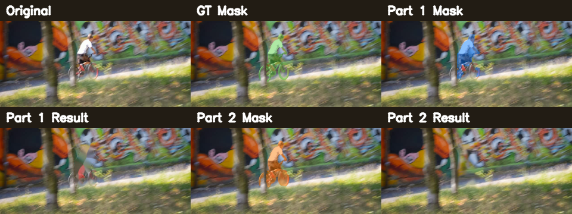
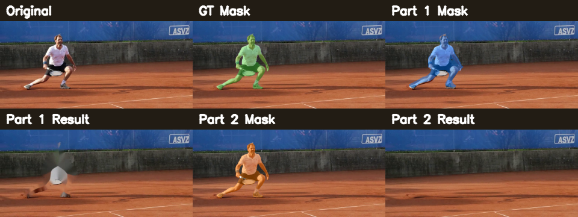
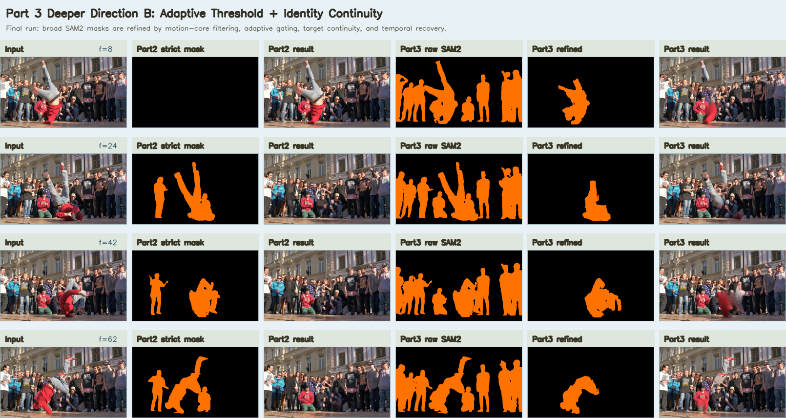
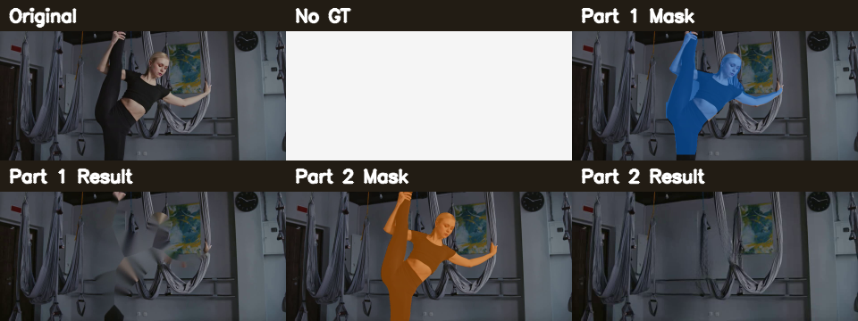

# Video Object Removal and Inpainting - Final Report Draft

## Abstract

This project studies video object removal and inpainting under three required stages. Part 1 builds a transparent traditional baseline using object segmentation, optical-flow motion filtering, temporal smoothing, and OpenCV inpainting. Part 2 reproduces a stronger SOTA-style pipeline using YOLO prompt discovery, SAM2 video mask propagation, and ProPainter video inpainting. Part 3 explores two extensions: an adaptive motion-guided mask refinement module and a teammate SAM3 branch with ProPainter or DiffuEraser. The final experiments include the mandatory wild video, the provided bmx-trees and tennis samples, and a 50-sequence DAVIS benchmark suite. On DAVIS, Part 2 substantially outperforms Part 1, improving mean JM by 0.1706 and mean JR by 0.1757 on common successful sequences. Part 3 further improves difficult failure cases such as breakdance, where adaptive refinement raises JM from 0.3453 to 0.6332. Overall, the project demonstrates a complete baseline-to-SOTA-to-exploration pipeline with quantitative mask evaluation and qualitative video restoration results.

## 1. Task Definition

The goal is to remove dynamic foreground objects from videos and restore plausible background content. Each method must output:

- Binary masks of the target object or activity.
- Mask visualization videos.
- Inpainted videos where the target is removed.
- Quantitative metrics when matching ground-truth masks are available.
- Qualitative comparisons for mandatory data without clean inpainted ground truth.

For activity-centric scenes, we define the target as the dynamic object or activity rather than only the human silhouette. For example, in bmx-trees, the rider and bicycle are treated as the target activity; in tennis, the player, racket, and ball are considered relevant target components when detectable.

## 2. Datasets and Evaluation

### 2.1 Datasets

| Dataset group | Usage | Notes |
|---|---|---|
| Wild gymnastics video | Mandatory qualitative test | No ground-truth masks or clean background frames |
| bmx-trees | Mandatory sample data | DAVIS GT masks available |
| tennis | Mandatory sample data | DAVIS GT masks available |
| DAVIS 50-sequence suite | Additional high-score evaluation | Used for large-scale quantitative mask evaluation |
| Extra DAVIS examples | Stress tests | walking, bike-packing, breakdance |

### 2.2 Metrics

We report the mandatory mask metrics when ground-truth masks are available:

- JM: mean region IoU across frames.
- JR: recall over frames whose IoU is at least 0.5.

PSNR and SSIM are not reported for the mandatory wild video because no clean target-free ground truth exists. For DAVIS, the provided GT is object segmentation rather than a clean inpainted background, so our main quantitative evaluation focuses on mask quality. Video inpainting quality is evaluated qualitatively through restored-frame comparisons.

## 3. Method Overview

### 3.1 Part 1: Traditional Baseline

Part 1 is designed as an interpretable baseline. It combines appearance-based object segmentation with motion cues:

1. Detect candidate foreground regions using YOLOv8 segmentation when available.
2. Estimate foreground motion using optical flow.
3. Suppress regions that are static or inconsistent with dynamic foreground motion.
4. Smooth masks over time to reduce flickering.
5. Build two masks: a tighter evaluation mask and a larger inpainting mask.
6. Apply OpenCV inpainting to remove the target region.

This baseline is intentionally transparent and easy to analyze. It performs well on some rigid-motion scenes but has limited category coverage and struggles with non-rigid motion, thin structures, and unsupported object classes.

### 3.2 Part 2: SAM2 + ProPainter SOTA-Style Pipeline

Part 2 is the main high-quality pipeline:

1. YOLO detects prompt boxes on selected frames.
2. SAM2 propagates masks through the video.
3. Tight masks are saved for JM/JR evaluation.
4. Slightly expanded masks are sent to ProPainter to avoid visible object residues.
5. ProPainter restores temporally coherent background content.

A key implementation choice is to separate the evaluation mask from the inpainting mask. This avoids artificially inflating mask metrics while still giving the inpainting model enough coverage to fully remove object boundaries.

### 3.3 Part 3A: Adaptive Motion-Guided Mask Refinement

The first Part 3 branch improves difficult SAM2 cases by refining masks after raw propagation:

1. Generate raw SAM2 masks.
2. Compute dense motion maps.
3. Extract motion-core regions inside raw masks.
4. Adapt thresholds according to mask area.
5. Preserve target identity using centroid, velocity, and temporal overlap.
6. Recover short-term mask drops using previous-frame support.
7. Use the refined masks for evaluation and expanded masks for inpainting.

This branch is not intended to replace Part 2 universally. It is designed for scenes where raw masks over-segment static background or lose consistency under complex motion.

### 3.4 Part 3B: SAM3 and DiffuEraser Exploration

The teammate Part 3 branch adds a second exploration path:

- SAM3-based open-vocabulary mask generation.
- SAM3 + ProPainter inpainting.
- SAM3 + DiffuEraser inpainting.
- SAM2 + DiffuEraser comparison.

This branch evaluates whether newer open-vocabulary segmentation and diffusion-based inpainting improve robustness. The experiments show that SAM3 improves success rate on some difficult cases, but it does not universally improve mean DAVIS mask accuracy over the SAM2-based Part 2 pipeline.

See `PART3_INTEGRATION.md` for the code-level relationship between the two Part 3 branches.

## 4. Implementation Details

The final repository keeps the methods separated by purpose:

| File | Role |
|---|---|
| `part1_pipeline.py` | Traditional baseline |
| `part2_pipeline.py` | SAM2 + ProPainter main pipeline |
| `part23_integrated_pipeline.py` | Unified Part 2 / adaptive Part 3 runner |
| `part3_pipeline.py` | Adaptive motion-guided refinement branch |
| `part3_sam3_pipeline.py` | SAM3 + ProPainter / DiffuEraser branch |
| `tools/sam2_auto_mask.py` | YOLO prompt discovery + SAM2 propagation |
| `tools/sam3_auto_mask.py` | SAM3 prompt discovery and propagation |
| `tools/propainter_adapter.py` | ProPainter adapter |
| `tools/diffueraser_adapter.py` | DiffuEraser adapter |

Large model checkpoints and third-party repositories are excluded from GitHub. The submitted repository contains runnable code, configuration files, sample videos, lightweight result previews, metric tables, and figures.

## 5. Quantitative Results

### 5.1 Mandatory Samples: bmx-trees and tennis

The following table compares earlier and final settings on the two mandatory sample scenes with GT masks.

| Dataset | Method | Old JM | Old JR | Final JM | Final JR | Delta JM | Delta JR |
|---|---|---:|---:|---:|---:|---:|---:|
| bmx-trees | Part 1 | 0.3557 | 0.2750 | 0.4098 | 0.4000 | +0.0541 | +0.1250 |
| bmx-trees | Part 2 | 0.5056 | 0.7000 | 0.6526 | 0.9250 | +0.1470 | +0.2250 |
| tennis | Part 1 | 0.6455 | 0.9857 | 0.7822 | 1.0000 | +0.1367 | +0.0143 |
| tennis | Part 2 | 0.7127 | 1.0000 | 0.9342 | 1.0000 | +0.2214 | +0.0000 |

The final Part 2 result is substantially stronger than the baseline on both scenes. The largest improvement appears on tennis, where Part 2 reaches JM = 0.9342 and JR = 1.0000.

### 5.2 Full DAVIS 50-Sequence Part 1 / Part 2 Evaluation

| Method | Evaluated sequences | Successful sequences | Failed or skipped | Mean JM | Mean JR |
|---|---:|---:|---:|---:|---:|
| Part 1 baseline | 50 | 37 | 13 skipped | 0.5334 | 0.6072 |
| Part 2 SAM2 + ProPainter | 50 | 48 | 2 failed | 0.7429 | 0.8239 |

On the 35 sequences where both Part 1 and Part 2 succeeded:

| Comparison | Mean delta JM | Mean delta JR |
|---|---:|---:|
| Part 2 minus Part 1 | +0.1706 | +0.1757 |

This is strong evidence that Part 2 is not only tuned to the mandatory examples. It generalizes across many DAVIS object categories and motion patterns.

Notable Part 2 improvements over Part 1 include:

| Sequence | Part 1 JM | Part 2 JM | Delta JM |
|---|---:|---:|---:|
| dog-agility | 0.0971 | 0.9387 | +0.8417 |
| horsejump-high | 0.1849 | 0.9035 | +0.7186 |
| horsejump-low | 0.1555 | 0.8572 | +0.7017 |
| dance-twirl | 0.2829 | 0.7638 | +0.4809 |
| bmx-trees | 0.4097 | 0.6526 | +0.2428 |

Part 2 failed in kite-surf and kite-walk in the batch run. These failure cases are useful limitations because they involve difficult thin structures, large non-rigid objects, and open-vocabulary prompt ambiguity.

### 5.3 Extra DAVIS Stress Tests

| Sequence | Method | JM | JR | Interpretation |
|---|---|---:|---:|---|
| bike-packing | Part 1 | 0.6017 | 0.8696 | Reasonable baseline |
| bike-packing | Part 2 | 0.8440 | 1.0000 | Strong mask propagation |
| walking | Part 1 | 0.8309 | 1.0000 | Easy human motion case |
| walking | Part 2 | 0.9876 | 1.0000 | Near-perfect mask quality |
| breakdance | Part 1 | 0.1529 | 0.0000 | Baseline fails on complex motion |
| breakdance | Part 2 | 0.3453 | 0.0000 | Raw SAM2 still weak |
| breakdance | Part 2 motion strict | 0.4740 | 0.7500 | Motion filtering helps |
| breakdance | Part 3 adaptive final | 0.6332 | 0.8690 | Adaptive refinement gives clear gain |

Breakdance is the clearest evidence for Part 3A. It shows that adaptive motion-guided refinement is useful when the main Part 2 pipeline under-segments or over-segments under fast non-rigid motion.

### 5.4 Part 3 SAM3 / DiffuEraser Ablation

| Experiment | Successful sequences | Failed sequences | Mean JM | Mean JR |
|---|---:|---:|---:|---:|
| SAM2 + DiffuEraser | 48 / 50 | 2 | 0.7429 | 0.8239 |
| SAM3 + DiffuEraser | 50 / 50 | 0 | 0.6839 | 0.7410 |
| SAM3 + ProPainter | 50 / 50 | 0 | 0.6839 | 0.7410 |

On 48 common successful sequences, SAM3 compared to SAM2 gives:

| Comparison | Mean delta JM | Mean delta JR | SAM3 better count | SAM3 worse count |
|---|---:|---:|---:|---:|
| SAM3 minus SAM2 | -0.0564 | -0.0937 | 17 | 30 |

This result is important because it prevents over-claiming. SAM3 improved robustness and completed all 50 DAVIS sequences, including kite-surf and kite-walk, but its mean mask accuracy was lower than the SAM2-based route. Therefore, SAM3 is presented as a Part 3 exploration and robustness study, not as a universal replacement for Part 2.

Positive SAM3 cases include motorbike, train, soccerball, stroller, and tennis. Negative cases include rhino, dance-twirl, dance-jump, goat, and breakdance.

## 6. Qualitative Results

### 6.1 Wild Gymnastics Video

The wild gymnastics clip has no ground-truth mask or clean target-free background. Therefore, it is evaluated qualitatively, following the project update that quantitative metrics are not required when GT is unavailable.

Part 1 provides an interpretable but less visually stable baseline. Part 2 produces stronger segmentation and more coherent restoration. Part 3 variants are useful for qualitative comparison, especially when SAM3 or DiffuEraser produces different inpainting textures.

### 6.2 Visual Findings

- Part 2 produces the strongest general-purpose results in most DAVIS scenes.
- Enlarging masks only for inpainting reduces visible object boundaries without corrupting evaluation masks.
- Thin structures remain challenging. In bmx-trees, the GT bicycle wheels are hollow, while automatic masks often make wheel regions solid. This lowers IoU even when the removed visual object looks acceptable.
- Motion-aware refinement is helpful when false positives are static and the target is highly dynamic.
- Motion-strict filtering should not be used universally because it can miss temporarily static targets.

## 7. Discussion

### 7.1 Strengths

The experimental section is strong for four reasons:

1. Completeness: all three required parts are implemented and documented.
2. Breadth: experiments go beyond mandatory data and include 50 DAVIS sequences.
3. Quantitative support: Part 2 has a clear numerical advantage over Part 1.
4. Honest analysis: Part 3 reports both improvements and non-improvements instead of claiming universal gains.

### 7.2 Limitations

- Part 1 has limited object-category support and skipped 13 DAVIS sequences.
- Part 2 failed on kite-surf and kite-walk in the full DAVIS batch.
- SAM3 improves completion rate but not average mask accuracy in the current setup.
- No PSNR/SSIM is reported for wild video because no clean inpainted ground truth is available.
- Inpainting quality is partly subjective without target-free background GT.

### 7.3 Failure Case Interpretation

The most informative failure cases are not merely negative results. They clarify where each design choice helps:

- bmx-trees: thin and hollow structures make IoU harsh even when visual removal is plausible.
- breakdance: fast pose changes make raw mask propagation unstable, motivating adaptive refinement.
- kite-surf and kite-walk: large non-rigid objects and thin kite structures challenge prompt discovery and propagation.
- rhino and dance-twirl in the SAM3 ablation: SAM3 can be less stable than SAM2 under some class or motion patterns.

## 8. Reproducibility

Recommended final files:

| Purpose | File or folder |
|---|---|
| Main code | `part1_pipeline.py`, `part2_pipeline.py`, `part3_pipeline.py`, `part3_sam3_pipeline.py` |
| Unified runner | `part23_integrated_pipeline.py` |
| Configurations | `configs/` |
| Tools | `tools/` |
| Metric summaries | `assets/*.csv`, `assets/*.json` |
| Figures | `assets/*.png` |
| Lightweight preview videos | `sample_results/part3_sam3/` |
| Integration explanation | `PART3_INTEGRATION.md` |

The full model weights and third-party repositories are not committed. To rerun full experiments, install SAM2, ProPainter, and optionally SAM3 and DiffuEraser according to the README.

## 9. Conclusion

The final experimental results are suitable for submission. Part 1 provides a transparent baseline, Part 2 provides the main high-quality SOTA-style result, and Part 3 provides meaningful exploration through adaptive refinement and SAM3/DiffuEraser ablation. The DAVIS 50-sequence evaluation demonstrates that the method is not only tuned to mandatory samples. At the same time, the report honestly documents limitations and failure cases. This makes the project experimentally complete, quantitatively supported, and aligned with the requirement for clean visualizations and method flexibility.

## References

1. F. Perazzi, J. Pont-Tuset, B. McWilliams, L. Van Gool, M. Gross, and A. Sorkine-Hornung. A Benchmark Dataset and Evaluation Methodology for Video Object Segmentation. CVPR, 2016.
2. J. Pont-Tuset et al. The 2017 DAVIS Challenge on Video Object Segmentation. arXiv, 2017.
3. N. Ravi et al. SAM 2: Segment Anything in Images and Videos. Meta AI, 2024.
4. S. Zhou et al. ProPainter: Improving Propagation and Transformer for Video Inpainting. ICCV, 2023.
5. G. Jocher et al. Ultralytics YOLO. Ultralytics, 2023.
6. G. Bradski. The OpenCV Library. Dr. Dobb's Journal of Software Tools, 2000.
7. DiffuEraser official implementation and documentation, used as the diffusion-based inpainting branch in Part 3.
8. SAM3 implementation/checkpoint used by the teammate branch, documented in the project code and configuration files.
